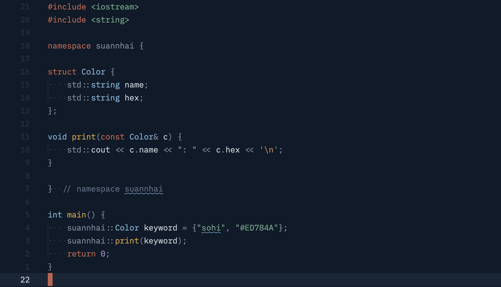
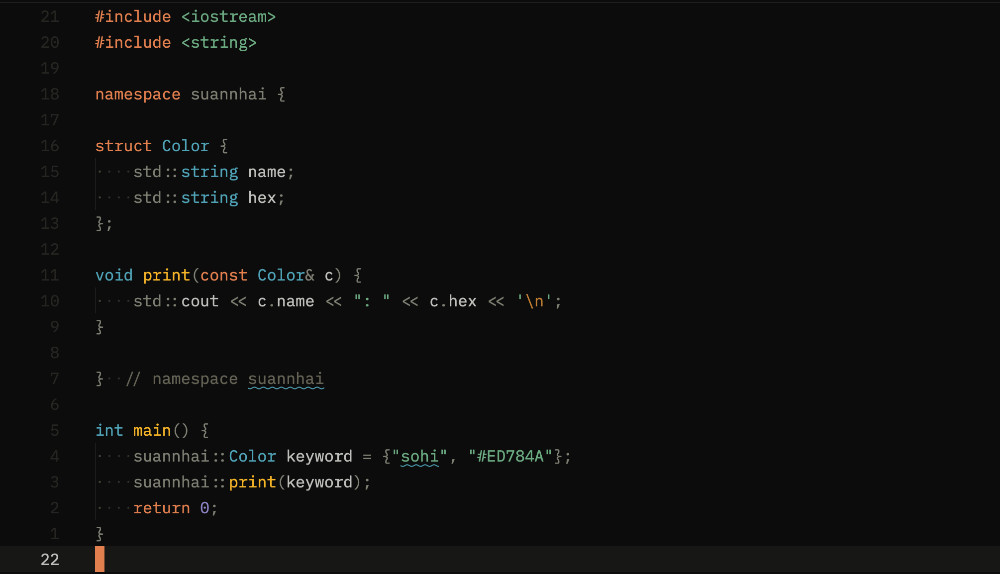
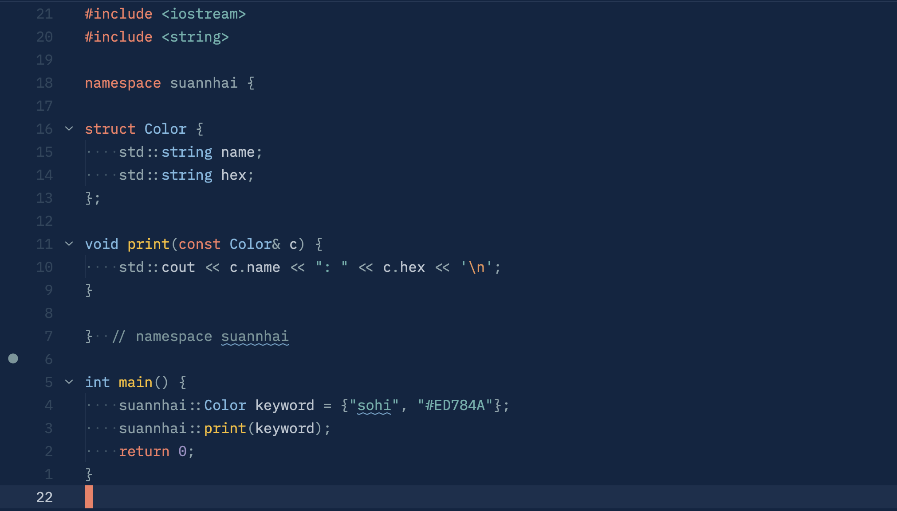

<h1 align="center">Suannhai for Neovim</h1>

<h4 align="center">
  <a href="#install">Install</a>
  ·
  <a href="#configuration">Configure</a>
  ·
  <a href="https://github.com/WeiTing1991/suannhai-theme">Suannhai Theme</a>
</h4>

<div align="center"><p>
    <a href="https://github.com/WeiTing1991/suannhai.nvim/pulse">
      
    </a>
    <a href="https://github.com/WeiTing1991/suannhai.nvim/blob/main/LICENSE">
      
    </a>
    <a href="https://github.com/WeiTing1991/suannhai.nvim/stargazers">
      
    </a>
    <a href="https://github.com/WeiTing1991/suannhai.nvim/issues">
      
    </a>
</p></div>

Traditional color themes from Formosa and Nippon for [Neovim](https://neovim.io/).

## Requirements

- Neovim >= 0.8.0
- `termguicolors` enabled

## Install

### lazy.nvim

```lua
{
  "WeiTing1991/suannhai.nvim",
  lazy = false,
  priority = 1000,
  build = "python3 scripts/sync-palettes.py",
  config = function()
    require("suannhai").setup({})
    vim.cmd.colorscheme("suannhai-jiufen")
  end,
}
```

> The `build` step fetches the latest color palettes from
> [suannhai-theme](https://github.com/WeiTing1991/suannhai-theme) on install
> and update. It requires Python 3. If unavailable, the bundled palettes are
> used as fallback.

## Configuration

`setup()` is optional. Defaults work out of the box.

```lua
require("suannhai").setup({
  transparent = false,
  on_colors = function(colors)
    -- Mutate palette values before highlights are built
  end,
  on_highlights = function(hl, colors)
    -- Override any highlight group after all groups are built
  end,
  plugins = {
    all = true,   -- enable all plugin groups
    auto = true,  -- auto-detect via lazy.nvim
    -- Per-plugin override:
    -- telescope = false,
  },
})
```

## Available Schemes

### Formosa

| Name | Appearance | Command | Preview |
| ---- | ---------- | ------- | ------- |
| Suannhai Jiufen | Dark | `:colorscheme suannhai-jiufen` |  |
| Suannhai Lam-ni | Dark | `:colorscheme suannhai-lam-ni` |  |
| Suannhai Hue-poo | Light | `:colorscheme suannhai-hue-poo` |  |

### Nippon

| Name | Appearance | Command | Preview |
| ---- | ---------- | ------- | ------- |
| Suannhai Rouiro | Dark | `:colorscheme suannhai-rouiro` |  |
| Suannhai Sumi | Dark | `:colorscheme suannhai-sumi` |  |
| Suannhai Koiai | Dark | `:colorscheme suannhai-koiai` |  |
| Suannhai Torinoko | Light | `:colorscheme suannhai-torinoko` |  |
| Suannhai Shironeri | Light | `:colorscheme suannhai-shironeri` |  |

## Supported Plugins

- [gitsigns.nvim](https://github.com/lewis6991/gitsigns.nvim)
- [telescope.nvim](https://github.com/nvim-telescope/telescope.nvim)
- [fzf-lua](https://github.com/ibhagwan/fzf-lua)
- [blink.cmp](https://github.com/Saghen/blink.cmp)
- [snacks.nvim](https://github.com/folke/snacks.nvim)
- [lazy.nvim](https://github.com/folke/lazy.nvim)
- [neo-tree.nvim](https://github.com/nvim-neo-tree/neo-tree.nvim)
- [mini.nvim](https://github.com/echasnovski/mini.nvim)

## Contributing

Bug reports, feature requests, and pull requests are welcome.
